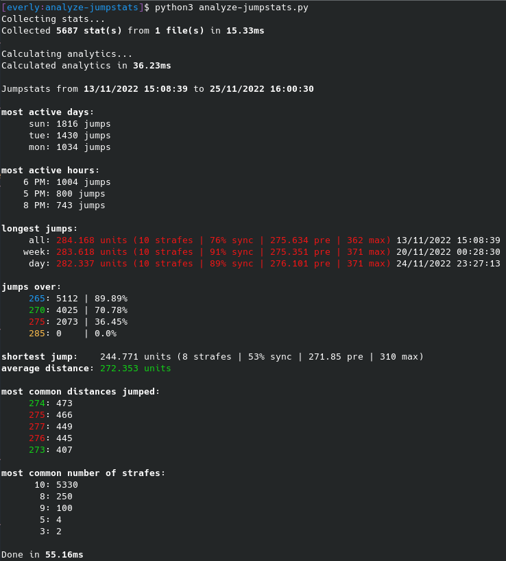

# Analyze Jumpstats

Quick script I made to analyze your jumpstats from a CSV file. \
Best to use with [CSGO Telnet jumpstats example](https://github.com/everlyy/csgo-telnet/blob/main/examples/jumpstats.py). \
Code is pretty bad because I made this really quick.

# How To Use

### Local Program

Put all your jumpstat CSV files in a folder called `stats` and then just run `AnalyzeJumpstats.py`. 

### Discord Bot

Make sure to install `discord` from pip.

Copy `config.def.py` to `config.py` and put your bot's token in there. \
Also for the first run make sure to set `discord_client.sync_tree` to `True` in `discord-bot.py`. \
Then just run `discord-bot.py`.

Then in Discord you can do `/analyze_jumpstats` and attach a CSV file with your jumpstats, and you'll see an embed with your stats summarized.

# Screenshots

### Terminal Output

### Discord Bot
